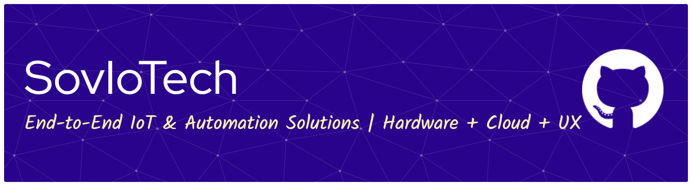

  

   

  # End-to-End IoT & Automation Solutions
  ### Hardware | Cloud Infrastructure | User Experience

   

  
  
  
   

---

## 🚀 About SovIoTech
We specialize in bridging the gap between physical hardware and cloud intelligence. As a full-service agency, we design scalable **IoT architectures**, build robust **automation systems**, and deploy **AI-driven analytics** for businesses worldwide.

Whether you need a custom embedded system, a real-time dashboard, or a complete industrial automation overhaul, we deliver production-grade solutions tailored to your operational needs.

### 🛠 Core Services
* **IoT & Embedded Systems:** Firmware development (C/C++), PCB integration, and sensor networks.
* **Cloud & DevOps:** Scalable infrastructure on AWS/Azure/GCP and containerized deployments.
* **Data & AI:** Real-time data processing, predictive maintenance models, and computer vision.
* **Full Stack Development:** Custom dashboards and mobile control apps (Flutter/React).

---

## 💻 Technology Stack

### 📡 IoT, Hardware & Protocols
     -%233C5280.svg?style=flat-square&logo=eclipsemosquitto&logoColor=white)  

### ☁️ Cloud, DevOps & Infrastructure
       

### 🧠 AI, Data Science & Python
     

### 🖥️ Backend & Database
      

### 📱 Frontend & Design
   

---

### 📊 GitHub Activity

 

 

